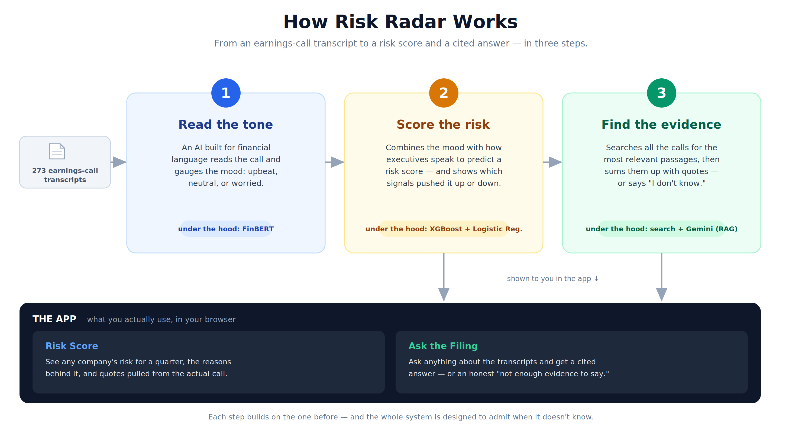

# Earnings Call Risk Radar

Predict stock risk from what executives *say* on earnings calls — and explain every prediction with grounded, cited evidence from the transcript.

A solo, 10-day, end-to-end data-science project: a cascaded 3-stage pipeline (FinBERT → XGBoost/Logistic Regression → RAG) over **273 real earnings-call transcripts** across **30 tickers** (Jun 2019 – Feb 2023), wrapped in a Streamlit web app.

> **Design philosophy:** real findings and honest interpretation over the high-number game. Where the signal is weak, this README says so; where a metric is a tripwire rather than ground truth, it's labeled as one.



---

## Table of contents

- [What it does](#what-it-does)
- [Results](#results)
- [Architecture](#architecture)
- [Project structure](#project-structure)
- [Data pipeline](#data-pipeline)
- [Setup (Windows)](#setup-windows)
- [Deployment](#deployment)
- [Limitations](#limitations)
- [Future work](#future-work)

---

## What it does

The app has two tabs:

**Tab 1 — Risk Score.** Pick a company and quarter. The app shows two risk scores (a 3-day and a 5-day horizon), the top features that drove each score in plain English, an auto-generated question built from those drivers, and two grounded evidence sections: direct quotes from *this* call, and similar discussion in *other* calls — both with citations and a faithfulness score.

**Tab 2 — Ask the Filing.** Ask any natural-language question about the transcripts (optionally scoped to one company). The system retrieves the most relevant passages, answers with footnote citations, displays a faithfulness check, and **abstains honestly** when it can't ground an answer rather than hallucinating.

Both tabs are backed by the same three-stage pipeline. The app adds no new ML — it's a presentation layer over the functions built in Days 4–8.

---

## Results

All numbers are on **held-out data the models never saw during training or selection.** Models were locked by cross-validation before the test set was touched once.

### Risk classification (held-out test, n = 44 calls)

| Horizon | Shipping model | Test AUC | Day-3 lexicon-only baseline |
|---|---|---|---|
| 3-day excess return | XGBoost (17 features) | **0.550** | 0.525 |
| 5-day excess return | Logistic Regression (17 features) | **0.566** | 0.538 |

Adding FinBERT contextual sentiment to the hand-crafted lexicon features produced modest, *consistent* gains across two different model types — the strongest single piece of evidence that FinBERT contributes real signal, not noise.

**Honest read:** earnings-call language carries a *weak but real* predictive signal at this dataset scale. AUC 0.55–0.57 is meaningfully above random (0.50) but is **not** a deployable trading signal. The binding constraint is data scale (~218 training rows, ~12 rows per feature), not the method. This is reported as a scientific finding, not an investment recommendation.

### RAG retrieval (n = 14 answerable eval queries)

| Metric | Value |
|---|---|
| Mean recall@10 | **1.00** |
| Mean recall@5 | 0.55 |
| Mean precision@5 | 0.80 |

Every hand-labeled gold chunk lands in the top-10. recall@5 < 1 is expected: most queries have 7–10 gold chunks competing for 5 slots.

### RAG generation & honesty

| Metric | Value |
|---|---|
| Mean lexical faithfulness | 0.70 |
| Citation health valid | 13 / 15 |
| Abstention on out-of-scope queries | **3 / 3** |
| LLM-as-judge (faithfulness / completeness / relevance) | q1 **5 / 5 / 5** |

The LLM-judge is a **demonstration at n = 1**, not a full benchmark. The complete n = 14 run is deferred because the free-tier Gemini daily cap dropped to **20 requests/day** mid-project — see [Limitations](#limitations) and `TODO_POST_DEPLOY.md`. Lexical faithfulness is a cheap *tripwire*, not a measurement-grade metric (it's blind to paraphrase); the LLM-judge is the intended stronger check.

---

## Architecture

The three stages form a **cascaded pipeline** — each stage's output feeds the next:

1. **Stage 1 sentiment** scores become **Stage 2 features.**
2. **Stage 2 risk drivers** shape **Stage 3's** adaptive retrieval question.


| Stage | Job | Key tech |
|---|---|---|
| 1 — Sentiment | Read tone per transcript section | FinBERT (`ProsusAI/finbert`), frozen / transfer learning |
| 2 — Risk classification | Predict 0–1 risk + interpretable drivers | XGBoost + Logistic Regression, SHAP / coefficients, 17 features |
| 3 — RAG | Retrieve evidence and generate cited answers | Arctic-embed-l-v2.0 (1024-d) → ChromaDB (13,518 chunks, cosine) → Gemini 2.5 Flash |

**Why these choices:** FinBERT over VADER because "liability" is neutral in finance, not negative. XGBoost/LR over deep learning because tabular data under 10k rows favors gradient-boosted trees and gives interpretable feature importance. RAG over fine-tuning because it's cheaper, updatable without retraining, and keeps answers grounded in auditable source text.

---

## Project structure

```
risk-radar/
├── app.py                       # Streamlit app — both tabs, caching, quota counter
├── .streamlit/
│   └── config.toml              # Disables file-watcher (fixes a ChromaDB init crash)
├── requirements.txt             # Curated runtime dependencies (pinned)
├── requirements_full.txt        # Full `pip freeze` snapshot (backup safety net)
├── .env.example                 # Template for GEMINI_API_KEY (real .env is gitignored)
├── README.md
├── TODO_POST_DEPLOY.md          # Known follow-ups (full LLM-judge run, etc.)
│
├── docs/
│   ├── architecture_simple.png  # Plain-language "how it works" diagram
│   └── architecture.png         # Detailed stage-by-stage diagram
│
├── data/
│   ├── raw/                     # gitignored — prices, transcripts, lexicons
│   ├── processed/
│   │   ├── transcripts.csv      # Day 1 — 274 deduplicated transcripts
│   │   ├── transcripts_v2.csv   # Day 2 — 273 (drops mislabeled WMT Investor Day)
│   │   ├── features.csv         # Day 2 — 9 lexicon features + per-ticker z-scores
│   │   ├── labels.csv           # Day 2 — excess-return labels (1/3/5-day windows)
│   │   ├── dataset.csv          # Day 2 — features + labels joined (273 × 27)
│   │   ├── dataset_v2.csv       # Day 4 — + FinBERT sentiment (273 × 52); model input
│   │   ├── chunks_day6.csv      # COMMITTED — 13,518 chunks; source for rebuild
│   │   └── embeddings_day6.npy  # COMMITTED — (13518, 1024) float32; source for rebuild
│   ├── eval/
│   │   ├── eval_set_day8.csv     # 20-query hand-labeled eval set
│   │   ├── eval_results_day8.csv # Per-query retrieval/generation metrics
│   │   ├── eval_summary_day8.md  # Recruiter-facing aggregate findings
│   │   └── eval_judge_day8.csv   # LLM-judge scores (q1 done; rest deferred)
│   └── gemini_usage.json        # gitignored — runtime daily-call counter
│
├── models/
│   ├── model_y3d_xgb_day5.joblib  # 3-day XGBoost classifier
│   ├── model_y5d_lr_day5.joblib   # 5-day Logistic Regression pipeline (scaler + LR)
│   └── feature_cols_day5.joblib   # The 17 feature names both models expect
│
├── notebooks/                   # Exploratory work, one notebook per phase
│   ├── 01_data_collection.ipynb # Day 1 — pull + dedup + clean transcripts and prices
│   ├── 02_features_labels.ipynb # Day 2 — lexicon features + return-based labels
│   ├── 03_modeling.ipynb        # Day 3 — time-based split, LR vs XGBoost baseline
│   ├── 04_finbert.ipynb         # Day 4 — FinBERT sentiment features
│   └── 05_modeling_v2.ipynb     # Day 5 — combined lexicon + FinBERT models
│
├── src/
│   ├── __init__.py
│   └── rag/
│       ├── __init__.py
│       ├── chunker.py           # Sentence-aware chunking (spaCy + Arctic tokenizer)
│       ├── embedder.py          # Arctic-embed-l-v2.0 embedding (1024-d, L2-normalized)
│       ├── vector_store.py      # ChromaDB loader + collection accessor
│       ├── retriever.py         # Query interface (top-K, metadata filters, similarity)
│       ├── gemini_client.py     # lru_cache singleton wrapper around the Gemini SDK
│       ├── generator.py         # Full RAG: retrieve → prompt → generate → verify
│       └── risk_explainer.py    # Stage 2 ↔ Stage 3 integration (explain_risk)
│
├── scripts/
│   ├── build_chroma.py          # Rebuild chroma_db from committed CSV + NPY (cold start)
│   ├── run_chunker.py           # Day 6 — transcripts → chunks_day6.csv
│   ├── run_embedder.py          # Day 6 — chunks → embeddings_day6.npy
│   ├── run_chroma_loader.py     # Day 6 — chunks + embeddings → chroma_db/
│   ├── run_eval.py              # Day 8 — retrieval + generation eval harness
│   ├── run_judge.py             # Day 8 — LLM-as-judge semantic scoring
│   ├── demo_retrieval.py        # Day 6 — sample retrieval queries
│   ├── demo_generation.py       # Day 7 — sample RAG answers
│   ├── demo_risk_explainer.py   # Day 7 — sample risk explanations
│   └── ...                      # eval-set builders + diagnostics
│
├── tests/
│   ├── test_arctic_embed.py     # Embedding-model sanity checks
│   ├── test_chunker_sample.py   # Chunker assertions on a 3-transcript sample
│   └── test_citation_parser.py  # 7 cases for the citation-health parser
│
└── chroma_db/                   # gitignored — rebuilt on first run by build_chroma.py
```

> Notebook filenames for Days 2–3 are indicative — adjust them to match your repo if they differ.

### Key modules at a glance

- **`src/rag/generator.py`** — the heart of the RAG layer. `generate_answer(query, k=5, filter=None, thinking=False)` runs retrieve → adaptive top-K (drop chunks below similarity 0.45; abstain if fewer than 2 qualify) → prompt → Gemini (with 503 retry) → footnote-citation parse → lexical faithfulness check → structured dict.
- **`src/rag/risk_explainer.py`** — `explain_risk(ticker, quarter)` loads both Day-5 models, extracts per-instance drivers (SHAP for XGBoost, exact coefficient math for LR), builds an adaptive question from content-bearing features, and returns scores + focused (this-call) and elsewhere (cross-call) RAG explanations.
- **`scripts/build_chroma.py`** — idempotent rebuild of the vector store from the committed `chunks_day6.csv` + `embeddings_day6.npy`. Skips if `chroma_db/` is already populated. Used on Streamlit Cloud's first run.

---

## Data pipeline

Two chains feed off the cleaned transcript corpus:

**Risk-model chain**
```
transcripts.csv → transcripts_v2.csv → features.csv + labels.csv
              → dataset.csv → dataset_v2.csv (+ FinBERT) → models/*.joblib
```

**RAG chain**
```
transcripts_v2.csv → chunks_day6.csv → embeddings_day6.npy → chroma_db/
```

The corpus was cleaned hard: 470 raw Kaggle rows → 285 unique (ticker, quarter) pairs after dedup → 274 after date parsing/filtering → **273** after dropping WMT 2020-Q4, a mislabeled Walmart Investor Day rather than an earnings call.

---

## Setup (Windows)

Requires **Python 3.11** and **Git**. All commands run in the VS Code integrated terminal (PowerShell).

```powershell
# 1. Clone
git clone https://github.com/Dsbhatt313/earnings-call-risk-radar.git
cd earnings-call-risk-radar

# 2. Create and activate a Python 3.11 virtual environment
py -3.11 -m venv venv
.\venv\Scripts\Activate.ps1
#   If activation is blocked, run ONCE (answer Y), then retry the line above:
#   Set-ExecutionPolicy -Scope CurrentUser RemoteSigned

# 3. Install dependencies
python -m pip install --upgrade pip
pip install -r requirements.txt
python -m spacy download en_core_web_sm

# 4. Add your free Gemini API key (from aistudio.google.com)
copy .env.example .env
#   then edit .env and set:  GEMINI_API_KEY=your_key_here

# 5. Build the vector store once (from the committed chunks + embeddings)
python -m scripts.build_chroma

# 6. Launch the app
streamlit run app.py
```

The app opens at `http://localhost:8501`.

> Because the file-watcher is disabled (see Limitations), after editing any file you must stop the app (`Ctrl + C`) and re-run `streamlit run app.py`.

---

## Deployment

Deployed on **Streamlit Cloud** (free, one-click from GitHub).

- **Vector store:** `chroma_db/` is **not** committed (`data_level0.bin` exceeds GitHub's 100 MB per-file limit). Instead, the source artifacts `chunks_day6.csv` (~18 MB) and `embeddings_day6.npy` (~53 MB) are committed, and `scripts/build_chroma.py` rebuilds the store on first run. This keeps the repo reproducible without Git LFS. First cold start runs the rebuild once (a few minutes); the store then persists across restarts.
- **Secrets:** set `GEMINI_API_KEY` as a Streamlit **secret** — never committed (`.env` stays gitignored).
- **Required at runtime:** `dataset_v2.csv`, `models/*.joblib`, the committed RAG artifacts, and `.streamlit/config.toml`.
- **Public-app caveat:** every visitor's clicks burn the owner's free-tier quota. The in-app counter warns but does not block (honest display over false lockout).

---

## Limitations

Documented honestly — these are characteristics and known trade-offs, not surprises.

1. **Weak predictive signal at this scale.** AUC 0.55–0.57 is above random but not a trading signal. ~218 training rows is the binding constraint; the method is sound, the data is small. n = 44 test rows is too small for statistical-significance claims.
2. **Free-tier Gemini quota is the hard limit.** The `gemini-2.5-flash` free tier capped at **20 requests/day** during the project (verified empirically; older `gemini-2.0-flash` dropped to 0). One risk analysis = 2 calls, one question = 1 call. This blocked the full LLM-judge eval (n = 1 shipped, n = 14 deferred).
3. **Displayed faithfulness is a lexical tripwire.** It's blind to paraphrase (an answer can be fully correct yet score low). Labeled as such in the UI; the LLM-judge is the intended stronger check.
4. **LLM-judge independence is weak.** The deferred judge is Gemini-on-Gemini (same vendor; same model after the free-tier shift). A cross-vendor judge is the proper fix (see future work).
5. **Cosine retrieval is tone-blind.** A query about "concerns about demand" can surface positive demand chunks; within a single call, retrieval can drift to topically-adjacent content. Reranking would help.
6. **Interview-format calls underperform.** 21 NFLX/late-TSLA calls lack the prepared-remarks/Q&A split; the system abstains gracefully rather than hallucinating, but coverage is weaker on these.
7. **One malformed source.** PYPL 2019-Q4's Q&A marker is misplaced, so its Q&A is labeled as `prep`. Still retrievable in unfiltered queries; only section-filtered queries are affected (1 of 273 rows).
8. **Cold start is slow.** The first request loads the Arctic embedder (~15–30 s). Subsequent calls are fast; on Streamlit Cloud this recurs per container spin-up.
9. **Answer cache is session-only.** It lives in `st.session_state`; closing the app empties it. Two sessions don't share cached answers.
10. **File-watcher disabled.** `.streamlit/config.toml` sets `fileWatcherType = "none"` to fix a ChromaDB double-init crash. Trade-off: no auto-reload on save.

---

## Future work

| Item | Priority | Notes |
|---|---|---|
| Complete the LLM-judge eval (n = 14) | High | 2-day free-tier schedule or a paid key; add a resume mechanism to `run_judge.py`. See `TODO_POST_DEPLOY.md`. |
| Quota-aware "demo mode" | High | Canned/precomputed output so a dry quota never shows a broken app. |
| Cross-vendor judge | Med | Claude or another vendor judging Gemini for true independence. |
| Reranking / query rewriting | Med | Addresses tone-blind cosine retrieval. |
| Larger eval set (50–100 queries) | Med | Moves from a measurement harness toward a benchmark. |
| Independent human relabeling | Med | Removes same-system labeling bias on the gold set. |
| Scale corpus to 5,000+ transcripts | Med | The realistic path to AUC ~0.62–0.68 — more samples, same pipeline. |
| Persistent / shared answer cache | Low | Disk- or DB-backed cache to extend quota across sessions. |
| Multi-provider abstraction (e.g. LiteLLM) | Low | Drop in a paid Claude/OpenAI key without code changes. |

---

## Tech stack

Python 3.11 · pandas · scikit-learn · XGBoost · SHAP · Hugging Face Transformers (FinBERT) · PyTorch · sentence-transformers (Arctic-embed) · spaCy · ChromaDB · Google Gemini API · Streamlit · Git/GitHub · Windows

---

*Built solo over 10 days as a portfolio project. The full day-by-day build log lives in the project journal.*