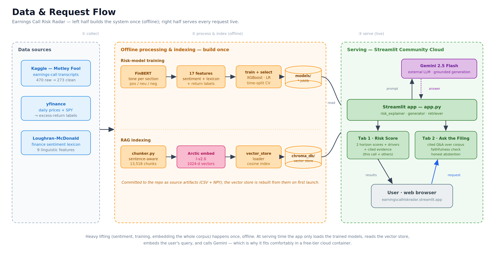
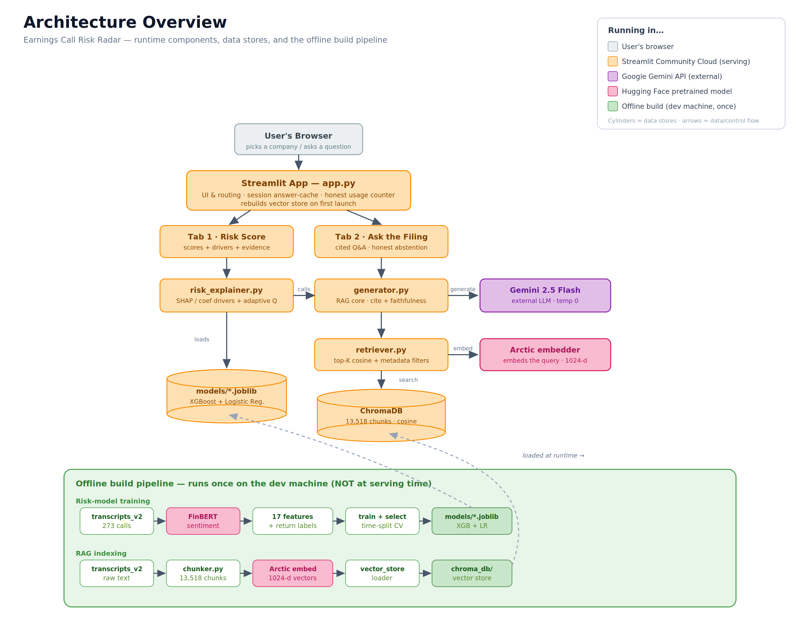

# Earnings Call Risk Radar

**Live app: https://earningscallriskradar.streamlit.app/**

Predict stock risk from what executives *say* on earnings calls — and explain every prediction with grounded, cited evidence pulled straight from the transcript.



---

## The problem

Every quarter, public companies hold earnings calls — an hour of management talking through results and taking analyst questions. Buried in that hour is signal: the tone executives use, the language they hedge with, the things they emphasize or avoid. Analysts read these transcripts by hand, which is slow, and general-purpose large language models can summarize them but will happily *invent* details that were never said — a dealbreaker when real money is on the line.

**Two hard questions sit at the center of this:**

1. Does the *language* of an earnings call carry any measurable signal about how the stock will move afterward?
2. Can an AI answer questions about these calls **honestly** — citing real quotes, and admitting when it doesn't know — instead of hallucinating?

## What I built to solve it

**Earnings Call Risk Radar** is an end-to-end system that tackles both, over **273 real earnings-call transcripts** spanning **30 companies** (June 2019 – February 2023).

It combines a cascaded **3-stage machine-learning pipeline** with a **retrieval-augmented generation (RAG)** layer, wrapped in a clickable Streamlit web app:

- A finance-tuned language model reads each call and measures its tone.
- Two classifiers turn that tone — plus *how* executives speak — into a risk score, and explain which signals drove it.
- A retrieval system finds the exact passages that back up each answer, generates a cited response, and **abstains** when the evidence isn't there.

The guiding principle throughout: **real findings and honest interpretation over inflated numbers.** Where the predictive signal is weak, the project says so. Where a metric is a rough tripwire rather than ground truth, it's labeled as one. An AI that confidently makes things up is worse than useless in finance — so honesty is treated as a first-class feature, not an afterthought.

---

## Table of contents

- [What it does](#what-it-does)
- [Results](#results)
- [Architecture](#architecture)
- [Project structure](#project-structure)
- [Data pipeline](#data-pipeline)
- [Setup (Windows)](#setup-windows)
- [Deployment](#deployment)
- [Limitations](#limitations)
- [Future work](#future-work)
- [Tech stack](#tech-stack)
- [Credits](#credits)

---

## What it does

The app has two tabs, both backed by the same pipeline.

### Tab 1 — Risk Score

Pick a company and a quarter. The app returns:

- **Two risk scores** — one for a 3-day horizon, one for a 5-day horizon — each a probability (0–1) that the stock *under*performs the market after the call. Two horizons because different signals matter over different windows, and showing both is more honest than cherry-picking the better-looking one.
- **Plain-English drivers** for each score. Instead of opaque feature names, you see explanations like *"Uncertainty language — raises risk"* or *"Negative tone in Q&A — lowers risk,"* computed per-prediction with SHAP (for the gradient-boosted model) and exact coefficient math (for the linear model).
- **An adaptive question**, auto-generated from the top risk-driving features, which the system then asks of the transcript itself.
- **Two grounded evidence sections**: direct quotes from *this* call, and similar discussion across *other* calls — each with footnote citations, a sources list, and a faithfulness score so you can judge how closely the answer sticks to the source.

### Tab 2 — Ask the Filing

A free-form question box over the entire transcript corpus (optionally scoped to a single company). The system:

- Retrieves the most semantically relevant passages from **13,518 indexed transcript chunks** via vector search.
- Generates an answer with inline `[1] [2]` footnote citations and a sources list mapping each citation to a specific chunk.
- Runs a **citation-health check** (every citation must point to a real retrieved chunk — no orphans, no hallucinated IDs) and a **faithfulness check** (do the answer's claims actually overlap the cited text?).
- **Abstains honestly** when no retrieved passage clears the relevance threshold — returning *"not enough evidence to answer"* instead of fabricating one. This is the behavior that separates a trustworthy tool from a confident liar.
- Offers an optional **"deeper reasoning" toggle** that enables the model's extended thinking for harder questions.

### Shared across both tabs

- A **session answer-cache** — ask the same thing twice and the second answer is instant, with zero API calls.
- An **honest daily-usage counter** that tracks only real model calls (abstentions and failures don't count) and is transparent about the free-tier limit rather than silently failing.
- **Graceful degradation** — a failed or rate-limited call renders a clean message, never a crash.

---

## Results

All numbers are on **held-out data the models never saw during training or selection.** Models were locked in by cross-validation *before* the test set was touched — and touched only once.

### Risk classification (held-out test, n = 44 calls)

| Horizon | Shipping model | Test AUC | Lexicon-only baseline |
|---|---|---|---|
| 3-day excess return | XGBoost (17 features) | **0.550** | 0.525 |
| 5-day excess return | Logistic Regression (17 features) | **0.566** | 0.538 |

Adding FinBERT contextual sentiment on top of the hand-crafted lexicon features produced modest but **consistent** gains across two *different* model types — the strongest single piece of evidence that the sentiment features contribute real signal, not noise.

**Honest read:** earnings-call language carries a **weak but real** predictive signal at this dataset scale. AUC 0.55–0.57 is meaningfully above random (0.50) but is **not** a deployable trading signal. The binding constraint is data scale (~218 training rows, ~12 rows per feature), not the method — the same pipeline on 5,000+ transcripts would likely reach AUC ~0.62–0.68. Reported as a scientific finding, not investment advice.

### RAG retrieval (n = 14 answerable eval queries)

| Metric | Value |
|---|---|
| Mean recall@10 | **1.00** |
| Mean recall@5 | 0.55 |
| Mean precision@5 | 0.80 |

Every hand-labeled gold chunk lands in the top-10 results. recall@5 < 1 is expected: most queries have 7–10 relevant chunks competing for 5 slots.

### RAG generation & honesty

| Metric | Value |
|---|---|
| Mean lexical faithfulness | 0.70 |
| Citation health valid | 13 / 15 |
| Abstention on out-of-scope queries | **3 / 3** |
| LLM-as-judge (faithfulness / completeness / relevance) | **5 / 5 / 5** on first query |

The LLM-as-judge evaluation is a **methodology demonstration**, not a full benchmark — the free-tier API daily cap (20 requests/day) blocked the complete run; the resume plan is documented in `TODO_POST_DEPLOY.md`. Displayed faithfulness is a cheap lexical *tripwire* (blind to paraphrase); the LLM-judge is the intended stronger check.

---

## Architecture

The three stages form a **cascaded pipeline** — each stage's output feeds the next:

1. **Stage 1 sentiment** scores become **Stage 2 features.**
2. **Stage 2 risk drivers** shape **Stage 3's** adaptive retrieval question.



| Stage | Job | Key tech |
|---|---|---|
| 1 — Sentiment | Read tone per transcript section | FinBERT (`ProsusAI/finbert`), used frozen (transfer learning) |
| 2 — Risk classification | Predict 0–1 risk + interpretable drivers | XGBoost + Logistic Regression, SHAP / coefficients, 17 features |
| 3 — RAG | Retrieve evidence, generate cited answers | Arctic-embed-l-v2.0 (1024-d) → ChromaDB (13,518 chunks, cosine) → Gemini 2.5 Flash |

**Why these choices:** FinBERT over general-purpose sentiment because in finance "liability" is neutral, not negative — domain matters. Gradient-boosted trees and logistic regression over deep learning because tabular data under 10k rows favors them and they yield interpretable feature importance. RAG over fine-tuning because it's cheaper, updatable without retraining, and keeps every answer grounded in auditable source text.

---

## Project structure

```
risk-radar/
├── app.py                       # Streamlit app — both tabs, caching, usage counter
├── requirements.txt             # Pinned runtime dependencies
├── README.md
├── TODO_POST_DEPLOY.md          # Documented follow-ups (e.g. full LLM-judge run)
├── .env.example                 # Template for GEMINI_API_KEY (real .env is gitignored)
├── .gitignore
│
├── .streamlit/
│   └── config.toml              # Disables file-watcher (fixes a ChromaDB init crash)
│
├── docs/
│   ├── architecture_simple.png  # Plain-language "how it works" diagram
│   └── architecture.png         # Detailed stage-by-stage diagram
│
├── data/
│   ├── raw/                     # gitignored — source prices, transcripts, lexicons
│   ├── processed/               # cleaned datasets + committed RAG artifacts
│   └── eval/                    # evaluation set, results, and summaries
│
├── models/                      # trained, serialized classifiers (joblib)
│
├── notebooks/                   # exploratory analysis, one notebook per phase
│
├── src/
│   ├── __init__.py
│   └── rag/                     # the retrieval-augmented-generation engine
│
├── scripts/                     # runnable pipeline steps, demos, and diagnostics
│
├── tests/                       # sanity tests for the embedder, chunker, and parser
│
└── chroma_db/                   # gitignored — vector store, rebuilt on first run
```

### Folder-by-folder

#### Root files

- **`app.py`** — the entire Streamlit application: both tabs, the session answer-cache, the daily usage counter, and the cold-start hook that rebuilds the vector store on first launch.
- **`requirements.txt`** — curated, pinned runtime dependencies (not a raw `pip freeze`, which can carry OS-specific pins that break a Linux deploy).
- **`TODO_POST_DEPLOY.md`** — honestly documented follow-ups deferred due to the free-tier API cap, chiefly completing the full LLM-as-judge evaluation.
- **`.env.example`** — shows the one required secret (`GEMINI_API_KEY`); the real `.env` is never committed.
- **`.gitignore`** — keeps secrets, raw data, the regeneratable vector store, and the runtime usage counter out of version control.

#### `.streamlit/`

- **`config.toml`** — sets `fileWatcherType = "none"`. This fixes a crash where Streamlit's source-file watcher re-initialized ChromaDB on every rerun and corrupted its bindings. Must be present in the repo or the crash can recur on the cloud.

#### `docs/`

- **`architecture_simple.png`** — the plain-language, three-step diagram used at the top of this README and in the demo.
- **`architecture.png`** — the detailed, stage-by-stage diagram with model names, metrics, and data flow.

#### `data/`

- **`raw/`** *(gitignored)* — original source data: daily stock prices (yfinance), the Kaggle Motley Fool transcript dump, and the Loughran-McDonald financial sentiment lexicon.
- **`processed/`** — every cleaned and engineered dataset:
  - `transcripts.csv` — 274 deduplicated transcripts (first clean pass).
  - `transcripts_v2.csv` — 273 transcripts; drops a mislabeled Walmart Investor Day that wasn't an earnings call. All modeling uses this.
  - `features.csv` — 9 lexicon-based linguistic features plus per-ticker z-scores.
  - `labels.csv` — outcome labels: stock excess return vs. the S&P 500 over 1-, 3-, and 5-day windows, binarized by median split.
  - `dataset.csv` — features joined to labels.
  - `dataset_v2.csv` — the above plus FinBERT sentiment features (273 × 52); **the input to the final models.**
  - `chunks_day6.csv` *(committed)* — all 13,518 transcript chunks with metadata; a source artifact for rebuilding the vector store.
  - `embeddings_day6.npy` *(committed)* — the (13518, 1024) embedding matrix; the second source artifact for the rebuild.
- **`eval/`** — the evaluation-harness outputs:
  - `eval_set_day8.csv` — the 20-query, hand-labeled evaluation set, stratified across use cases.
  - `eval_results_day8.csv` — per-query retrieval and generation metrics.
  - `eval_summary_day8.md` — the readable aggregate of the evaluation findings.
  - `eval_judge_day8.csv` — LLM-as-judge scores (first query scored; remainder deferred).

#### `models/`

Serialized, trained classifiers and their feature schema (`joblib`). The two **shipping** models are:

- **`model_y3d_xgb_day5.joblib`** — the XGBoost classifier for the 3-day horizon.
- **`model_y5d_lr_day5.joblib`** — the Logistic Regression pipeline (scaler + LR) for the 5-day horizon.
- **`feature_cols_day5.joblib`** — the list of 17 feature names both shipping models expect, in order.

Earlier candidate models are kept for provenance (`model_y1d_lr_v1.joblib`, `model_y3d_lr_v2.joblib`, `model_y5d_xgboost.joblib`, `feature_cols.joblib`) — the experiments the final two were selected over.

#### `notebooks/`

Exploratory, phase-by-phase analysis — data collection and cleaning, feature engineering and labeling, the baseline modeling comparison, FinBERT sentiment extraction, and the final combined model. The production logic was later extracted from these into `src/` and `scripts/`; the notebooks remain as the auditable record of how each decision was reached.

#### `src/rag/` — the RAG engine

- **`__init__.py`** — package marker.
- **`chunker.py`** — splits transcripts into sentence-aware chunks (~300 tokens, 50-token overlap) using spaCy for sentence boundaries and the Arctic tokenizer for budgeting; labels each chunk by section (prepared remarks / Q&A / interview).
- **`embedder.py`** — embeds chunks with Snowflake's Arctic-embed-l-v2.0 into 1024-dim, L2-normalized vectors.
- **`vector_store.py`** — loads chunks + embeddings into a persistent ChromaDB collection and exposes an accessor for downstream code.
- **`retriever.py`** — the query interface: embeds a query, runs cosine search, applies metadata filters (ticker, quarter, section), and returns top-K chunks with similarity scores.
- **`gemini_client.py`** — a cached singleton wrapper around the Gemini SDK; loads the API key, builds one client per process, fails loudly if misconfigured.
- **`generator.py`** — the full RAG flow: retrieve → adaptive top-K filtering (drop low-similarity chunks; abstain if fewer than two qualify) → prompt build → generate (with retry on transient errors) → parse citations → faithfulness check → structured result.
- **`risk_explainer.py`** — the integration layer connecting Stage 2 to Stage 3: loads both shipping models, extracts per-prediction drivers, builds the adaptive question, and returns scores plus focused and cross-call RAG explanations.

#### `scripts/`

Runnable, single-purpose entry points:

- **`build_chroma.py`** — rebuilds the vector store from the committed CSV + NPY; idempotent (skips if already built). This is what runs on the cloud's first launch.
- **`run_chunker.py`**, **`run_embedder.py`**, **`run_chroma_loader.py`** — the offline pipeline stages: transcripts → chunks → embeddings → vector store.
- **`run_eval.py`** — the evaluation harness (retrieval + generation metrics + abstention behavior).
- **`run_judge.py`** — the LLM-as-judge runner for independent semantic scoring.
- **`build_eval_set.py`**, **`write_eval_set.py`** — construct and serialize the hand-labeled evaluation set.
- **`demo_retrieval.py`**, **`demo_generation.py`**, **`demo_risk_explainer.py`** — standalone demos of each capability.
- **`sanity_check_embeddings.py`**, **`verify_edge_cases.py`**, **`diagnose_qa_marker.py`**, **`diagnose_pypl_2019q4.py`**, **`diag.py`** — diagnostics that document and verify known data edge cases (the malformed PYPL transcript, the two Q&A-marker variants, embedding sanity).

#### `tests/`

- **`test_arctic_embed.py`** — verifies the embedder: correct dimensionality, high similarity for related sentences, low for unrelated, working query-prefix mechanism.
- **`test_chunker_sample.py`** — six assertions on a sample (no empty chunks, token budget respected, unique IDs, clean section labels, working overlap).
- **`test_citation_parser.py`** — seven cases covering the citation-health parser (clean citations, undefined footnotes, orphan sources, hallucinated chunk IDs, duplicates, multi-citations).

#### `chroma_db/` *(gitignored)*

The persistent ChromaDB vector store. Not committed (one index file exceeds GitHub's 100 MB per-file limit); rebuilt from the committed source artifacts on first run.

---

## Data pipeline

Two chains feed off the cleaned transcript corpus:

**Risk-model chain**
```
transcripts.csv → transcripts_v2.csv → features.csv + labels.csv
              → dataset.csv → dataset_v2.csv (+ FinBERT) → models/*.joblib
```

**RAG chain**
```
transcripts_v2.csv → chunks_day6.csv → embeddings_day6.npy → chroma_db/
```

The corpus was cleaned aggressively: **470** raw Kaggle rows → **285** unique (ticker, quarter) pairs after dedup → **274** after date parsing → **273** after dropping a mislabeled Walmart Investor Day that had been filed as an earnings call.

---

## Setup (Windows)

Requires **Python 3.11** and **Git**. All commands run in PowerShell (e.g. the VS Code integrated terminal).

```powershell
# 1. Clone
git clone https://github.com/Dsbhatt313/earnings-call-risk-radar.git
cd earnings-call-risk-radar

# 2. Create and activate a Python 3.11 virtual environment
py -3.11 -m venv venv
.\venv\Scripts\Activate.ps1
#   If activation is blocked, run ONCE (answer Y), then retry the line above:
#   Set-ExecutionPolicy -Scope CurrentUser RemoteSigned

# 3. Install dependencies
python -m pip install --upgrade pip
pip install -r requirements.txt
python -m spacy download en_core_web_sm

# 4. Add your free Gemini API key (from aistudio.google.com)
copy .env.example .env
#   then edit .env and set:  GEMINI_API_KEY=your_key_here

# 5. Build the vector store once (from the committed chunks + embeddings)
python -m scripts.build_chroma

# 6. Launch the app
streamlit run app.py
```

The app opens at `http://localhost:8501`.

> Because the file-watcher is disabled (see Limitations), after editing a file you must stop the app (`Ctrl + C`) and re-run `streamlit run app.py`.

---

## Deployment

Live on **Streamlit Community Cloud** (free): **https://earningscallriskradar.streamlit.app/**

- **Vector store:** `chroma_db/` is **not** committed — one index file exceeds GitHub's 100 MB per-file limit. Instead the source artifacts `chunks_day6.csv` (~18 MB) and `embeddings_day6.npy` (~53 MB) are committed, and `scripts/build_chroma.py` rebuilds the store on the first cloud launch (a one-time step of a few minutes; it then persists across restarts). This keeps the repo fully reproducible without Git LFS.
- **Secrets:** `GEMINI_API_KEY` is set as a Streamlit **secret**, never committed.
- **Required at runtime:** `dataset_v2.csv`, `models/*.joblib`, the committed RAG artifacts, and `.streamlit/config.toml`.
- **Public-app note:** every visitor's queries draw on the owner's free-tier API quota. The in-app counter is transparent about this and degrades gracefully rather than blocking.

---

## Limitations

Documented honestly — these are known trade-offs and characteristics, not surprises.

1. **Weak predictive signal at this scale.** AUC 0.55–0.57 beats random but is not a trading signal; ~218 training rows is the binding constraint, and n = 44 test rows is too small for significance claims.
2. **Free-tier API quota is the hard limit.** The model's free tier capped at 20 requests/day during the project. One risk analysis = 2 calls; one question = 1 call. This deferred the full LLM-judge evaluation.
3. **Displayed faithfulness is a lexical tripwire.** It's blind to paraphrase — an answer can be fully correct yet score low. Labeled as such in the UI; the LLM-judge is the intended stronger measure.
4. **LLM-judge independence is limited.** The judge shares a vendor (and, after a free-tier shift, a model) with the generator. A cross-vendor judge is the proper fix.
5. **Cosine retrieval is tone-blind.** A query about "concerns over demand" can surface positive demand passages; within one call, retrieval can drift to adjacent topics. Reranking would help.
6. **Interview-format calls underperform.** ~21 calls (mostly Netflix) lack the prepared-remarks/Q&A split; the system abstains gracefully rather than hallucinating, but coverage is weaker on them.
7. **One malformed source.** A single transcript (PYPL 2019-Q4) has a misplaced Q&A marker, so its Q&A is labeled as prepared remarks. Still retrievable in unfiltered queries; only section-filtered queries are affected (1 of 273).
8. **Cold start is slow.** The first request loads the embedder (~15–30 s); subsequent calls are fast. On the cloud this recurs whenever the container spins up.
9. **Answer cache is session-only.** It lives in session state, so closing the app clears it; separate sessions don't share cached answers.
10. **File-watcher disabled.** Required to fix the ChromaDB init crash; the trade-off is no auto-reload on save during local development.

---

## Future work

| Item | Priority | Notes |
|---|---|---|
| Complete the LLM-judge evaluation | High | Run the full set on a fresh-quota schedule or a paid key; add a resume mechanism. See `TODO_POST_DEPLOY.md`. |
| Quota-aware "demo mode" | High | Precomputed answers so a depleted quota never shows a broken app. |
| Cross-vendor judge | Medium | A different vendor's model judging the generator, for true independence. |
| Reranking / query rewriting | Medium | Addresses tone-blind cosine retrieval. |
| Larger evaluation set (50–100 queries) | Medium | Moves from a measurement harness toward a benchmark. |
| Independent human relabeling | Medium | Removes same-system labeling bias on the gold set. |
| Scale the corpus to 5,000+ transcripts | Medium | The realistic path to AUC ~0.62–0.68 — more data, same pipeline. |
| Persistent / shared answer cache | Low | A disk- or DB-backed cache to extend quota across sessions. |
| Multi-provider abstraction | Low | Drop in a paid model from another vendor without code changes. |

---

## Tech stack

**Language & tooling:** Python 3.11 · Git/GitHub · VS Code · Windows

**Data & modeling:** pandas · NumPy · scikit-learn · XGBoost · SHAP

**NLP & embeddings:** Hugging Face Transformers (FinBERT) · PyTorch · sentence-transformers (Arctic-embed-l-v2.0) · spaCy · Loughran-McDonald lexicon

**RAG & app:** ChromaDB · Google Gemini API · Streamlit (deployed on Streamlit Community Cloud)

---

## Credits

Built by **Dhruvansh Bhatt** as a solo, end-to-end portfolio project — from data collection through deployment.

Claude (Anthropic) was used throughout as a development collaborator: reasoning through design decisions, code review, debugging, and documentation.

---

*Earnings Call Risk Radar is a research and engineering demonstration. Its risk scores are a scientific finding about language signal, not investment advice, and should not be used to make financial decisions.*